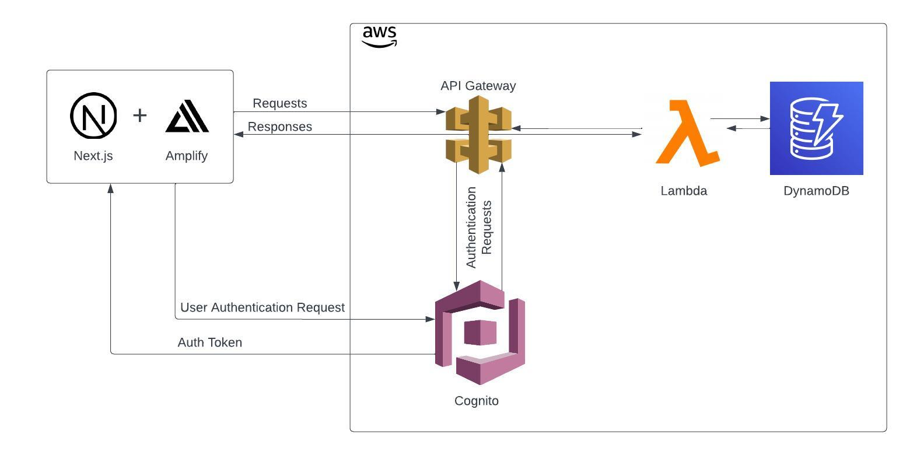
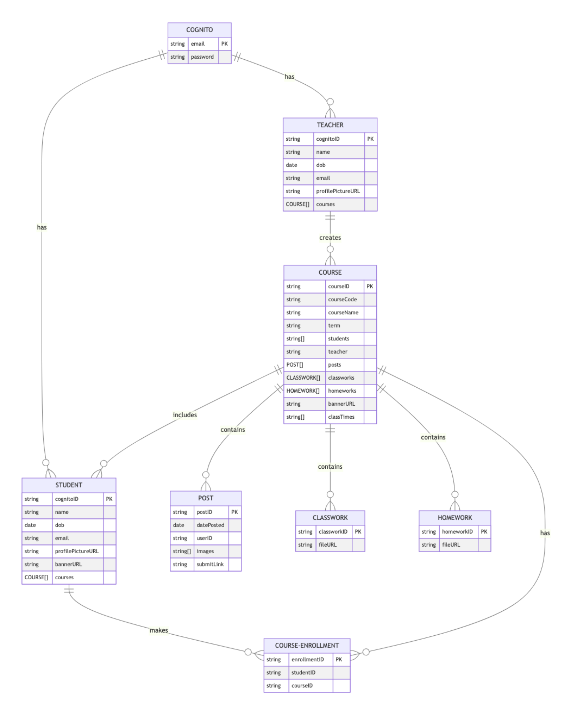
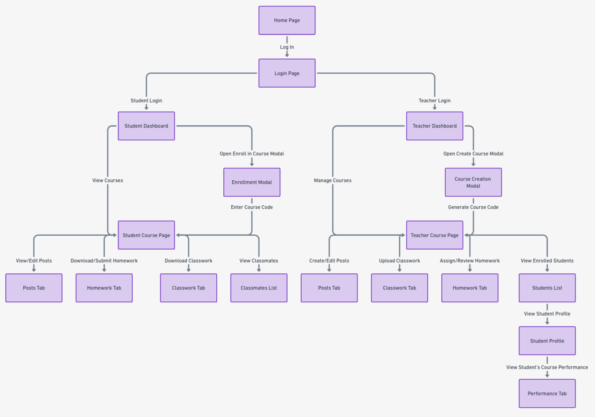

# High Level Component Diagram

---

The system architecture integrates client-side components, primarily Next.js and Amplify, with Amazon Web Services (AWS) to create a robust and scalable application framework. These front-end elements provide the user interface and logic, seamlessly interacting with the back-end services hosted on AWS.

User authentication managed is by AWS Cognito, ensuring protected access. Requests from the client applications are funneled through the API Gateway, which acts as a centralized entry point. This setup allows efficient management and routing of requests to the appropriate AWS Lambda functions. These Lambdas are serverless computing elements, executing specific business logic in an event-driven manner, contributing to the system's scalability and efficiency.

At the core of the data management is DynamoDB, Amazon's NoSQL database service. It handles data storage and retrieval, underpinning the application with a flexible and highly available data layer. The overall system architecture, as depicted in the component diagram, showcases the seamless integration and flow of data and functionalities between the client-side components and the AWS services. This integration highlights the system's capability to support a dynamic, efficient, and scalable application environment.

# Entity Diagram

The entity-relationship diagram for the educational platform presents a detailed schema that integrates various interconnected entities: Cognito, Teacher, Student, Course, Post, Classwork, and Homework. Central to this structure is the 'Cognito' table, which underpins user authentication, defined by attributes such as email and password. This table is integral to the identification of both 'Teacher' and 'Student' entities.

The 'Teacher' entity, linked through the Cognito ID, encompasses personal details like name and date of birth, along with an array of associated courses they instruct. This mirrors the 'Student' entity, which also includes a Cognito ID and personal information, but instead focuses on an array of courses in which the student is enrolled.

The 'Course' table is a critical component, detailing elements such as course code, name, term, teacher, class time, and arrays categorizing students, posts, classwork, and homework. Each course acts as a nexus, connecting teachers, students, and various academic materials.

Further detailing the platform's functionality, the 'Post' table captures the essence of user-generated content, recording data like post ID, date posted, user ID, and submission links. This parallels the structure of the 'Classwork' and 'Homework' tables, which store specific academic details, including file URLs, to manage and link academic materials effectively within the platform.

# Flow Chart

The Learning Management System (LMS) is meticulously designed to offer an intuitive and efficient user experience, catering to both students and teachers. Beginning with a welcoming landing page, the journey through the LMS is straightforward and secure, guiding users to a login process that ensures the protection and integrity of user data. Once authenticated, the LMS presents a critical juncture where users specify their role within the platform, choosing either student or teacher, which then tailors the subsequent interface and options according to their selected role.

For students, the experience within the LMS is centered around a personalized dashboard. This dashboard not only serves as a launchpad for course enrollment, facilitated through a user-friendly enrollment modal, but also acts as a central hub for their academic engagements. It lists all courses in which the student is currently enrolled, with each course having its own dedicated page. These course pages are rich with features like tabs for posts, homework, classwork, and a list of classmates, thus creating an all-encompassing and organized learning environment that caters to their educational needs.

Teachers, on the other hand, are greeted with a dashboard that mirrors the student’s in utility but is tailored for their unique requirements. It includes a course creation modal, a tool for setting up new courses or managing existing sections. The dashboard provides an overview of all the courses they are currently instructing, with detailed sections for posts, classwork, homework, and a comprehensive list of students. This list is particularly significant for teachers, as it allows them to delve into the academic performance of each student, offering a pivotal tool for monitoring progress and providing tailored support and feedback.

In essence, the LMS is designed with a keen focus on user-friendliness and functionality, ensuring a seamless navigation experience that is customized to the specific needs of students and teachers. 

