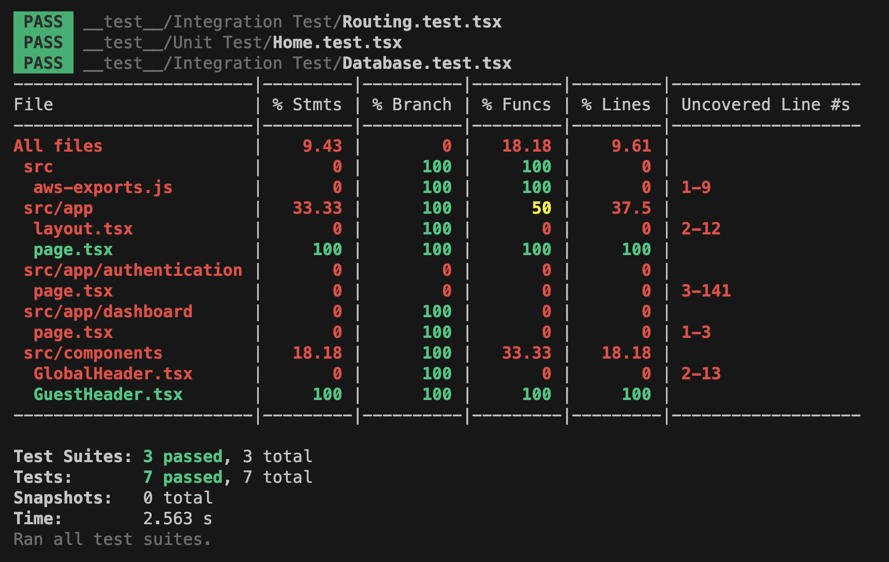

# Learning Management System (LMS) Development

### Overview

This project involves the development of a comprehensive Learning Management System (LMS), "Learning Made Simple", aimed at unifying various educational tools and platforms for a seamless learning and teaching experience.

### Run

To run this Next.js project

- clone the repository
- run `npm install` in the root directory
- run `npm run dev` to start the server

### Test Coverage Report

### Problem Statement

Educational institutions globally face challenges with fragmented LMS experiences, leading to inefficiencies for both students and educators. This project aims to streamline this experience, providing a unified platform for all educational needs.

### Proposal

We propose a unified LMS, combining features from Blackboard, Google Classroom, Pupil Path, and Microsoft Teams. This platform will provide a consistent experience, reducing the learning curve and improving productivity.

### Solution Overview

A user-friendly platform with tools for course management, assignments, communication, and collaboration, integrated with popular third-party tools.

### Plan

**What Are We Building**

A comprehensive LMS, "Learning Made Simple", integrating various educational tools into a single platform.

### How It Works

A unified dashboard for students and educators, with integrated third-party tools and a focus on user-friendliness.

### Timeline

- Development: 2 months
- Beta Testing: Begins 1 month into development
- Launch: 2 months from project start
