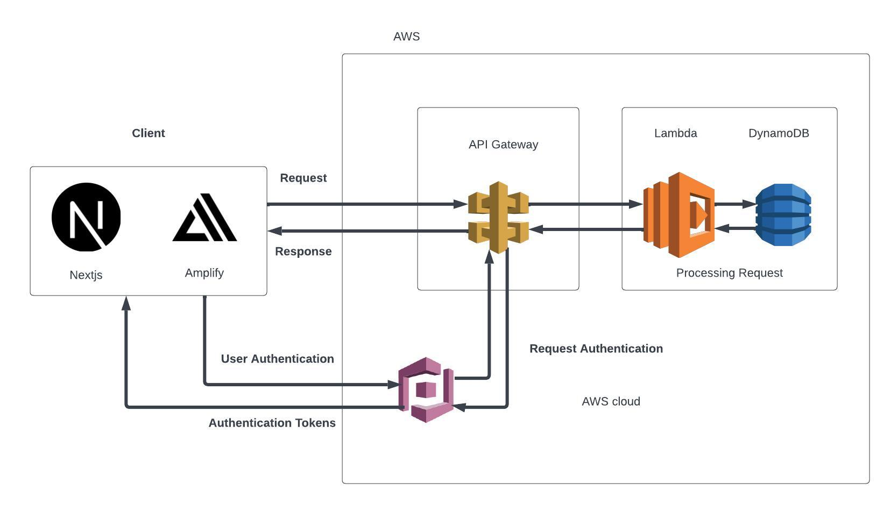

# high level component

In the proposed system architecture, the client components, representing applications such as Next's and Amplify, are intricately connected to the AWS ecosystem through a well-structured component diagram. The core of user authentication is managed by AWS Cognito, serving as a secure and scalable identity verification service. The client applications interact with the system through API Gateway, acting as a central entry point for requests. Behind the scenes, AWS Lambda functions handle specific functionalities, ensuring a serverless and efficient execution environment. The data layer is facilitated by DynamoDB, Amazon's NoSQL database service, providing a flexible and highly available storage solution. This component diagram illustrates a seamless integration of client applications with key AWS services, fostering a robust and scalable architecture for the overall system.

# Entity Diagram

The presented Entity-Relationship (ER) diagram outlines the structural elements and relationships within an educational platform, depicting the entities and attributes associated with Cognito, Teacher, Course, Student, Post, Classwork, and Homework. The Cognito entity serves as a fundamental authentication layer with email and password attributes. The Teacher entity is identified by a Cognito ID and includes personal details like name and date of birth. Notably, teachers are associated with courses through an array attribute. The Course entity is characterized by a unique ID, course code, name, term, teacher, and arrays for students, posts, classwork, homework, and class time. Students, identified by their Cognito ID, maintain basic details and are linked to courses they are enrolled in. The Post entity contains information about posts, including a unique ID, posting date, user ID, and submission link. Similarly, the Classwork and Homework entities store relevant information with file URLs. Overall, this ER diagram provides a comprehensive representation of the entities and relationships crucial for an organized and functional educational platform.

# Flow Chart

The user journey within the proposed flowchart navigates seamlessly through various components of an educational platform. Starting from the homepage, users are directed to the login page, where they can choose between two roles: student or teacher. On the student side, a well-organized dashboard awaits, featuring an enrollment modal for course selection. Each selected course leads to a dedicated course page, offering tabs for posts, homework, classwork, and classmates, fostering a comprehensive learning experience. Conversely, the teacher side includes a dynamic dashboard and a course creation modal for managing sections. The teacher's course page encompasses tabs for posts, classwork, homework, and a student list. The latter serves as a centralized hub for student performance evaluation, allowing teachers to select specific students and gain insight into their academic progress. This flowchart encapsulates a user-centric design, providing an intuitive and structured path for both students and teachers within the educational platform.

